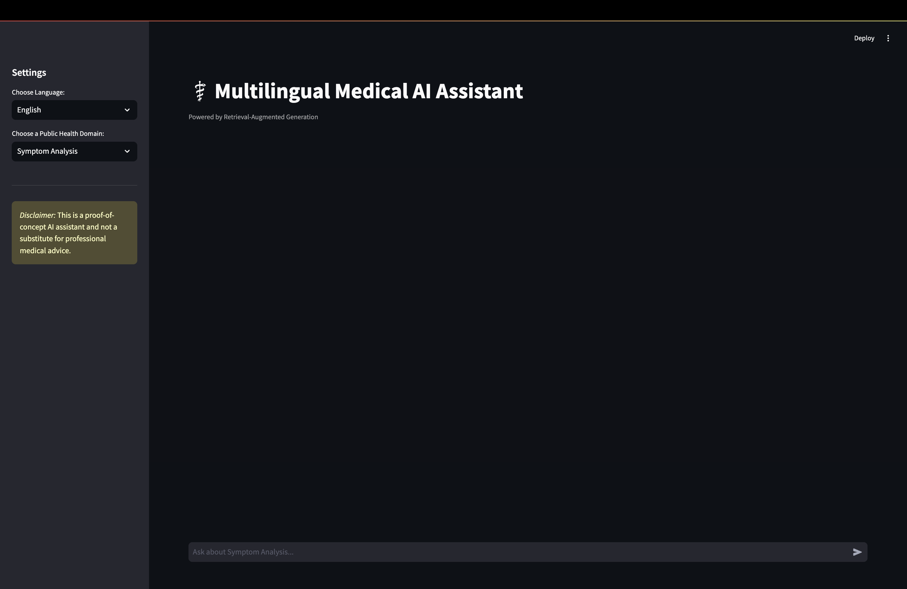

# 🏥 Multilingual Medical AI Assistant

A sophisticated Retrieval-Augmented Generation (RAG) system that provides accurate medical information across 50+ languages. This AI-powered assistant specializes in three key healthcare domains: symptom analysis, disease outbreak alerts, and medical misinformation detection. Built with state-of-the-art language models and vector search technology, it delivers precise, source-verified responses in a user-friendly chat interface.

## 🚀 Quick Start

### Prerequisites
- **Python 3.8 or higher**
- **8GB+ RAM** (16GB recommended)
- **10GB+ free disk space** for AI models
- **Git** for cloning the repository

### Installation & Setup

1. **Clone the repository**
```bash
git clone https://github.com/MaztaiHere/disease-awareness-chatbot/
cd disease-awareness-chatbot
```

2. **Create and activate virtual environment**
```bash
# Windows
python -m venv venv
venv\Scripts\activate

# macOS/Linux
python3 -m venv venv
source venv/bin/activate
```

3. **Install dependencies**
```bash
pip install -r requirements.txt
```

4. **Prepare your medical data**
   - Create the directory structure:
   ```bash
   mkdir -p data/raw
   ```
   - Place your CSV files in `data/raw/`:
     - `outbreaks_data.csv` - Disease outbreak information
     - `symptoms_data.csv` - Symptom and disease data
     - `misinformation_data.csv` - Medical fact-checking content

5. **Process your data**
```bash
python data_processing.py
```
*This converts your CSV files into optimized text chunks for the AI system*

6. **Launch the medical assistant**
```bash
streamlit run src/app.py
```

## 📁 Project Structure After Setup

```
medical-ai-assistant/
├── src/
│   ├── app.py                 # Streamlit web interface
│   └── rag_core.py           # Core AI engine with RAG
├── data_processing.py        # Data preprocessing script
├── requirements.txt          # Python dependencies
├── data/
│   ├── raw/                  # Your original CSV files
│   │   ├── outbreaks_data.csv
│   │   ├── symptoms_data.csv
│   │   └── misinformation_data.csv
│   └── processed/            # Auto-generated processed data
│       ├── outbreak_chunks.json
│       ├── symptom_chunks.json
│       └── misinformation_chunks.json
├── vector_db/               # ChromaDB vector storage (auto-created)
├── models/                  # AI models (auto-downloaded, ~7GB)
└── README.md
```

## 🎯 First Run Experience

When you run `streamlit run src/app.py` for the first time:

### Initial Setup Phase
1. **AI Model Download** (10-20 minutes)
   - The system automatically downloads:
     - Mistral-7B language model (4GB) for response generation
     - mBART-50 translation model (2GB) for 50+ languages
     - BGE embedding model (1GB) for document search
   - Progress bars show download status
   - All models are cached for future use

2. **Vector Database Construction**
   - Processes your medical data into searchable vectors
   - Creates separate knowledge bases for each domain
   - Builds optimized indexes for fast retrieval

### Application Interface


**Once loaded, you'll see:**
- **Left Sidebar**: Language selector (50+ options) and domain chooser
- **Main Chat Area**: Interactive conversation interface
- **Real-time Processing**: Thinking indicators and source citations
- **Multi-language Support**: Ask questions in any supported language

### Expected First Responses
- **Symptom Analysis**: "What are COVID-19 symptoms?" → 2-3 sentence response with source documents
- **Outbreak Alerts**: "Recent dengue outbreaks?" → Current outbreak information with locations
- **Misinformation**: "Do vaccines cause autism?" → Fact-based clarification with evidence

## 🔄 How the AI Pipeline Works

1. **Input**: User question in any language
2. **Translation**: Convert to English for processing
3. **Retrieval**: Find relevant medical documents from vector database
4. **Generation**: Create accurate 2-3 sentence response using Mistral-7B
5. **Translation**: Convert answer back to user's preferred language
6. **Output**: Display response with source citations

The system ensures every answer is grounded in your medical data while maintaining natural, conversational responses across all supported languages.
